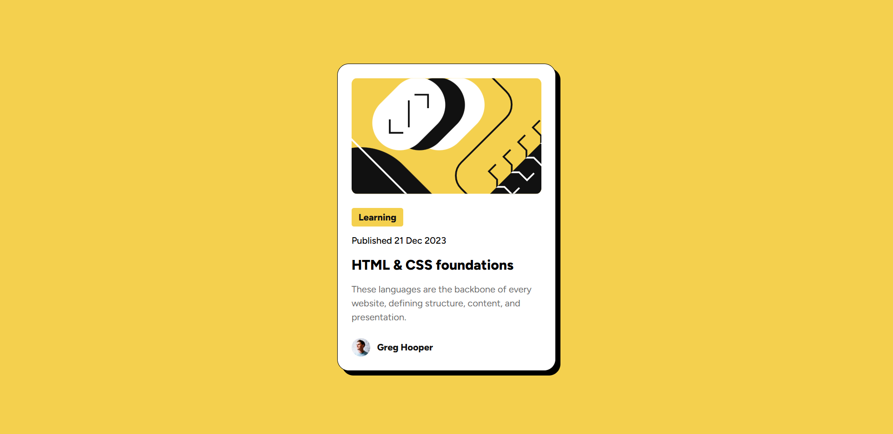

# Frontend Mentor - Blog preview card solution

This is a solution to the [Blog preview card challenge on Frontend Mentor](https://www.frontendmentor.io/challenges/blog-preview-card-ckPaj01IcS). Frontend Mentor challenges help you improve your coding skills by building realistic projects. 

## Table of contents

- [Overview](#overview)
  - [The challenge](#the-challenge)
  - [Screenshot](#screenshot)
  - [Links](#links)
- [My process](#my-process)
  - [Built with](#built-with)
  - [Continued Development](#continued-development)
  - [What I learned](#what-i-learned)
  - [Useful resources](#useful-resources)
- [Author](#author)

## Overview

### The challenge

Users should be able to:

- See hover and focus states for all interactive elements on the page

### Screenshot




### Links

- Solution URL: [Solution URL here](https://www.frontendmentor.io/solutions/blog-preview-card-using-css-and-html-VVtMMl6wWW)
- Live Site URL: [Live site URL here](https://zzz-ren.github.io/Frontend-blog-preview-card/)

## My process

### Built with

- Semantic HTML5 markup
- CSS custom properties
- Flexbox
- CSS Grid
- Mobile-first workflow
### What I learned

I tried to utilize rem more, which made this challenge a lot easier conbining it with dynamic vw values.

```html
<h2 class="title">HTML & CSS foundations</h2>
```
```css
.title {
  font-size: 1.5rem;
  line-height: 150%;
  letter-spacing: 0px;
  font-weight: 800;
}
```
### Continued development

 Next step should be diving deeper into responsive design tools in CSS and practicing more. I am also gonna focus more on comin gup with better layouts incorporating semantic elements. I feel like I can't use them that intuitively yet.

### Useful resources

- [PX to REM Converter](https://nekocalc.com/px-to-rem-converter) - This is an amazing article which helped me finally understand XYZ. I'd recommend it to anyone still learning this concept.

## Author

- Website - [Dhiren Rathod](https://www.dhiren.thenetnexus.com)
- Frontend Mentor - [@zZz-ren](https://www.frontendmentor.io/profile/zZz-ren)